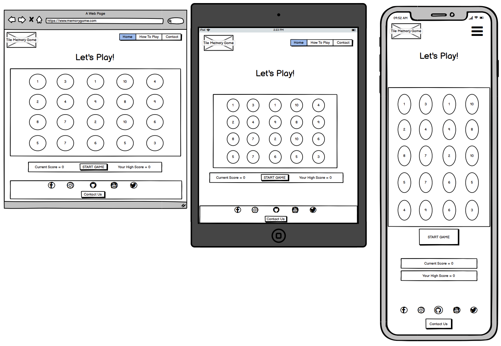
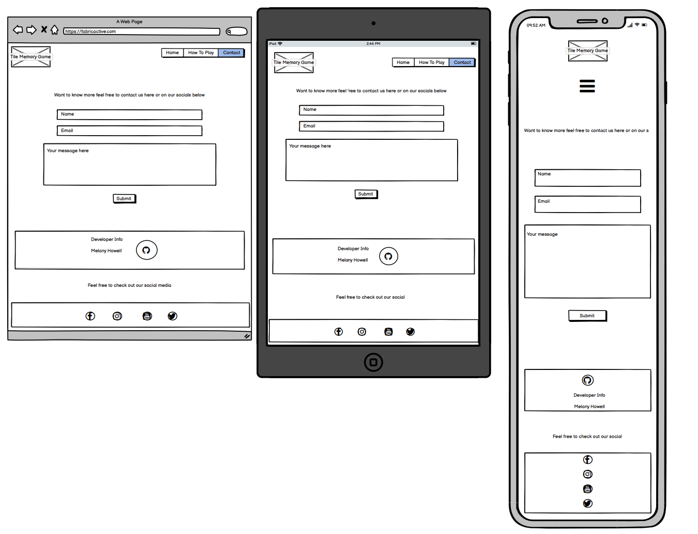
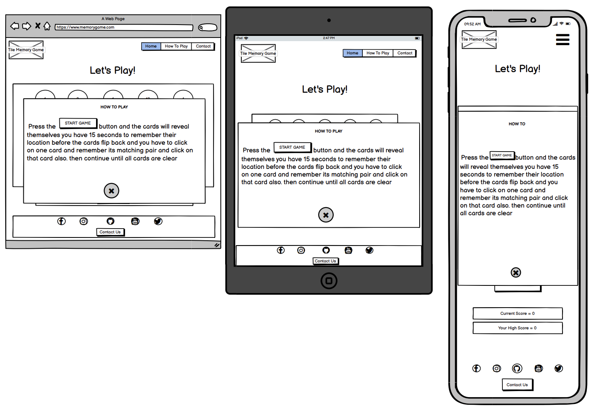

# Portfolio Project 2 - 

I have decided to go with the memory game [This Site] (https:/) for my second project and have looked into the following examples from the following sources for inspiration.
1)Source -
Picture Example
2)Source -
Picture Example

 location of picture for multiscreen

## Live Site
[Memory Game](Site address)

## Repository
[https://github.com/melanyhowell/Project2](https://github.com/melanyhowell/Project2)

---

## Contents
+ [Project Requirements]{#project-requirments}
+ [Objectives](#Objectives)
+ [Target Audience](#target-audience)
+ [User Experience: UX](#user-exerience-ux)
    + [Initial Concept](#initial-concept)
    + [User Stories](#user-stories)
    + [Wireframes](#wireframes)
        + [Home Page](#home-page)
        + [Product Page](#productservices-page)
        + [Contact Form Page](#contact-form-page)
        + [Form Confirmation Page](#form-confirmation-page)
    + [Site Structure](#site-structure)
    + [Colour Pallette](#colour-pallette)
    + [Typography](#typography)
    + [Imagery](#imagery)
+ [Features](#features)
    + [Included Features](#included-features)
        + [Header](#header)
        + [Home](#home)
        + [Footer](#footer)
        + [Product Page](#product-page)
            + [Product Information](#product-information)
        + [Contact Page](#contact-page)
            + [Contact Form](#contact-form)
            + [Form Confirmation](#form-confirmation)
        + [Future Features](#future-features)
    + [Technologies Used](#technologies-used)
    + [Testing](#testing)
    + [Deployment](#deployment)
    + [Credits](Credits)
        + [Content](#content)
        + [Media](#media)
        + [Code](#code)
    + [Acknowledgements](#acknowledgements)

---
## Project Requirements

Main technologies need to be used
    - HTML, CSS and JavaScript
    - Optional: jQuery or any other JavaScript libraries, external APIs.

Mandatory Requirements
    - Dynamic Front End Project: Write custom JavaScript, HTML and CSS code to create a front-end web application consisting of one or more HTML pages with significant interative functionality.
    - Site Responses: Use JavaScript to have the site produce relevant responses dependent on users' actions.
    - Information Architecture: Incorporate a main navigation menu (unless irrelevant) and structured layout (you might want to use Bootstrap to accomplish this).
    - Documentation: Write a README.md file for your project that explains what the project does and the value that it provides to its users.
    - Version Control: Use Git & GitHub for version control.
    - Attribution: Maintain clear separation between code written by you and code from external sources (e.g. libraries or tutorials). Attribute any code from external sources to its source via comments above the code and (for larger dependencies) in the README.
    -Deployment: Deploy the final version of your code to a hosting platform such as GitHub Pages.

---
## Objectives
This project has the folowing requirements:
+ A game that can be fun to play
+ Simple single-player pattern-matching memory game
+ Clear explananaions on how to play the game and their progress.

## Target Audience 

+ Target audience is anyone looking to challenge their memory.
+ Incorporated friendly generic pictures to appeal to all audiences

---

## User Exerience: UX

### Initial Concept
I wanted to incorporated an old style game style to my website as my website would be no more than 3 pages and fairly easy to navigate.
With a simple card turn memory game as the feature.

### User Stories

Being the primary user I expect the following;

+ Want a game that is easy to play and reset. 
+ With a move and timer counter that I can follow to improve on.
+ If I need instructions to play the game they should be easy to navigate to aswell as a way of contacting the websites owners.
+ Links to owners social sites and developers links.

As the owner I want the following from my site;

+ Easy and fun to play, Make player want to keep playing.
+ Ease of use of website
+ Ways for people to get in contact with us

As a developer I am looking to provide the following;

+ No accesibility issues
+ A game that is enjoyable
+ Satisfies the above wants of the user and owner

### Wireframes

I created my Wireframes using [Balsamiq](https://balsamiq.com). 

From the original designs I have changed a few aspects.
+ Nav bar loaction
+ Contact button on footer removed for consistency on every page
+ Score system originally though was not practical now changed to timer and moves tracking.
+ How to page changed from popup to webpage as menu option limited use of popup function.

#### Home/Game Page

#### Contact Page

#### How To Play Popup/Page

### Site Structure

Memory Game Website consists of 3 pages the Home PAge which hold the game, the "How To" Page which gives instructions on how to play, and the "Contact" Page which allows the user to email directly or access the owners or developers social netwroks for more info.

### Colour Pallette

I wanted my game site to have a happy colour that wouldn't prevent the font of the pages to be changed too drastically from black or gray.

### Typography

The fonts I selected were;
+ Bungee 
+ Prosto One
+ Righteous
That have been imported from [Google Fonts](https://fonts.google.com/).
I chose these fonts as they all have an element of the old style gaming arcade games to them which helps lend to the style of a simple game look.

### Imagery

The imagery I choose was to be as generic as possible but something that would still be relatable and appealing, my one wish while searching for compatible and similar style cartoons was more variety in colour as I feel the images are strongly based on Gray.

---

## Features

In trying to keep my Website simplistic to allow for ease of play i have utilised the following features.

### Included Features

#### Header

+ Logo - simple logo of a joystick represents the fun purpose of this website.
+ Navbar recessed to the side with an expandable feature to show further detail and navigation when requested.

#### Home

+ I tried to keep the Game page as uncluttered as possible while stil having nagigation access.

#### Footer

+ Social Media & Contact Links for Owners and Developer

#### How To Play Page

+ Simple incructions on how to play and a link back to the game below.

#### Contact Page

#### Contact Form

+ Contact Form
    + Name
    + Email
    + Message Area
    + JavaScript allowing user to email owner directly from webpage.

+ Developer details
#### Form Confirmation

Once Send message has been clicked a popup appears saying request was submitted sucessfully.
### Future Features

+ Levels of difficulty
+ links to other games
+ Score rankings with other players

---

## JavaScript Game Process

### Required Features
+ controls
    + Start game function
    + time eleapsed counter
    + moves completed counter
    + Stop game function
+ Images and cards
    + 10 animals provided for variation only 8 pairs will be shown at once
+ Random selection

### Proceses Needed
+ Arrange tracking of moves
    + move counted only after second card selected
+ Arrange Time to be tracked
    + format seconds and minutes
+ Need Cards 8 pairs 
    + cards need to be flipped
    + shuffle cards
+ if cards match
+ if cards dont match

---

## Technologies Used

+ [HTML5](https://html.spec.whatwg.org/)
+ [CSS](https://www.w3.org/Style/CSS/Overview.en.html)
+ [JavaScript](https://www.javascript.com/)
+ [Balsamic](https://balsamiq.com/wireframes/)
+ [Google Fonts](https://fonts.google.com/)
+ [Font Awesome](https://fontawesome.com/)
+ [Chrome Developer Tools](https://developer.chrome.com/docs/devtools/)
+ [GitHub](https://github.com/)
+ [GitPod](https://www.gitpod.io/)
+ [Multi Device Mock Up Generator](https://techsini.com/multi-mockup/)
+ [Bootstrap](https://getbootstrap.com/docs/5.2/getting-started/introduction/)

---

## Testing

To see what tools I used and how I overcame bugs and flaws in my devlopment journey of the Fiber Active site please [click here](testing.md) 

## Deployment

The site was deployed to GitHub pages.

+ Go To your Git Hub Repository
+ Under Repository Name, click on "Settings" 

+ Click on "Pages" options on the left hand side of the screen

+ under "build & deployment, & under "source" select "main Branch".
+ and then select publishing source "(root)
+ click Save
+ this will then give you your Git Pages address

## Credits

+ Inspiration for Email confirmation popup comes from youtube link - (https://www.youtube.com/watch?v=AF6vGYIyV8M) - [Easy Tutorials]
+
+ I looked up on youtube for some tutorial help with javascript and the memory games and used the following for reference - (https://github.com/code-sketch/memory-game/)

### Media

Obtained from the free photo sites such as 
+ [Pexels](https://www.pexels.com/) for Background Image

### Code

+ Issues I used the following references;
    + [W3Schools](https://www.w3schools.com/)
    + [Bootstrap](https://getbootstrap.com/docs/5.2/getting-started/introduction/)
    + [Code Institute](https://learn.codeinstitute.net/courses/course-v1:CodeInstitute+CSE101+2020_Q2/courseware/be0e510a3aca4bccb6e0bba4cf7cf06b/5255d165b5284d728b13bd224144d984/)
    + [MDN](https://developer.mozilla.org/en-US/)

## Acknowledgements

This Site was developed for the purpose of my portfolio 2 Project for the full stack diploma.
Thanks to my Mentor Harry Dhillon for his support.

Melany Howell 2023
